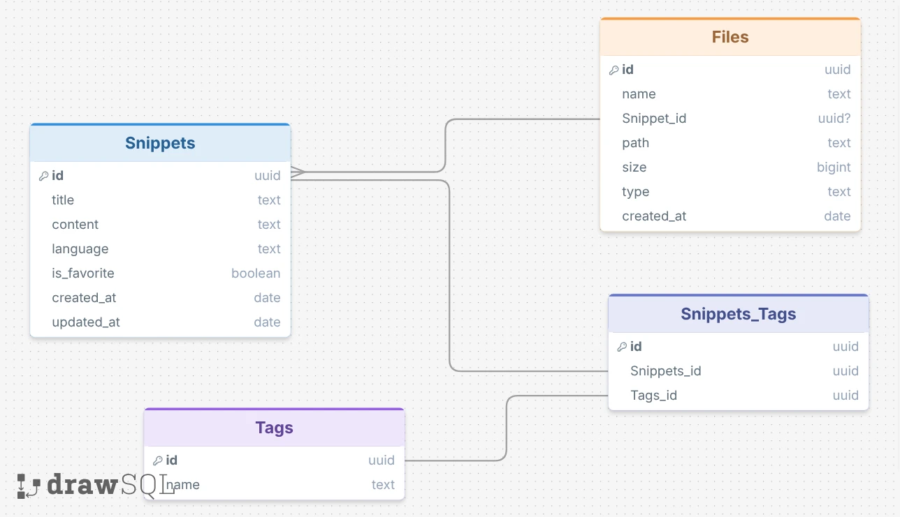

# SnipVault 🚀

SnipVault is a premium, high-performance mobile application designed for developers to save, organize, and enrich code snippets offline. Built using **Expo (v55)**, **React Native**, and **TypeScript**, the app integrates local database storage, native file management, and an AI coding assistant.

---

# Demo LInk
Youtube: https://youtu.be/Ml8MlB3Ulg0
## 📱 Features

- **Local-First Architecture:** Complete offline functionality with high-performance local queries.
- **Smart Syntax Highlighting:** Interactive and colorful rendering of multiple languages inside snippet code blocks.
- **AI Coding Assistant:** Integrates OpenRouter models to Summarize, Improve, or Explain code snippets with automatic response caching.
- **Advanced File Manager:** Dedicated space to manage snippet screenshot attachments, exported code files, and downloaded coding templates.
- **Universal Sharing & Exports:** Export snippets as `.js`, `.json`, or `.txt` files directly onto the device or share them across apps using native share sheets.
- **Global Theme Engine:** Sleek light and dark modes tailored with developer-themed slate/obsidian color palettes.

---

## 🛠️ Technology Stack

- **Core Framework:** [Expo (v55)](https://docs.expo.dev/versions/v55.0.0/) & React Native (New Architecture / Fabric ready)
- **Navigation:** [Expo Router](https://docs.expo.dev/router/introduction/) (File-system based routing)
- **Database (ORM):** [Drizzle ORM](https://orm.drizzle.team/) & [Expo SQLite](https://docs.expo.dev/versions/v55.0.0/sdk/sqlite/)
- **File System Management:** `expo-file-system` (utilizing the new class-based `File` and `Directory` APIs in v55)
- **State Management:** [Zustand](https://github.com/pmndrs/zustand)
- **Syntax Highlighting:** `react-native-code-highlighter` & `react-syntax-highlighter`
- **Native Sharing:** `expo-sharing`
- **Image Picker:** `expo-image-picker`

---

## 📁 Architecture & Directory Structure

```text
├── assets/                     # Images, icons, and static assets
├── drizzle/                    # Drizzle migrations schema folder
└── src/
    ├── app/                    # File-based Expo Router navigation
    │   ├── (tabs)/             # Main Tab Navigator (Home, Favorites, Files, Settings)
    │   │   ├── _layout.tsx     # Tab configuration and styling
    │   │   ├── index.tsx       # Home dashboard (Search, filter, list snippets)
    │   │   ├── favorites.tsx   # Favorites list
    │   │   ├── fileScreen.tsx  # Interactive File Manager
    │   │   └── settings.tsx    # App configurations & API key management
    │   ├── snippet/            # Dynamic snippet routes
    │   │   ├── [id].tsx        # Detailed snippet viewer & AI terminal
    │   │   └── create.tsx      # Create and edit snippets form
    │   └── _layout.tsx         # Root app layout context
    │
    ├── constants/
    │   └── constants.ts        # Design tokens & Light/Dark theme palettes
    │
    ├── db/                     # Database client & services
    │   ├── client.ts           # Drizzle & SQLite client initialization
    │   ├── Schema.ts           # Database tables and relational schemas
    │   └── services/           # DB queries for snippets, tags, and files
    │
    ├── services/               # Native API integrations
    │   ├── ai.ts               # OpenRouter client & prompting cache layer
    │   ├── fileSystem.ts       # Native folder setup, copy, move & downloads
    │   └── sharingSnippet.ts   # Expo sharing handler
    │
    └── store/
        └── themeStore.ts       # Zustand global theme state provider
```

---

## 🗄️ Database Schema



The database uses **Drizzle ORM** with **SQLite** to manage relationships efficiently:
- **`snippets`:** Stores snippet `title`, `content`, code `language`, creation/update timestamps, and `is_favorite` status.
- **`tags`:** Stores unique hashtag labels (`name`).
- **`snippet_tags`:** Junction table enabling a **many-to-many relationship** between snippets and tags (with `onDelete: 'cascade'`).
- **`files`:** Keeps track of files linked to the database, supporting three types:
  - `image`: Screenshot attachments bound to a snippet.
  - `code`: Locally exported snippet files.
  - `template`: Downloaded code templates from external sources.

---

## 🎨 Screens & User Interface

### 1. Dashboard (Home)
- Real-time instant search filtering through snippet title, code content, or language.
- Quick-tap bookmarking to toggle favorite status.
- Language badges highlighting code types.
- Clean floating action button (FAB) to create new snippets.
- Global theme switcher for seamless dark and light mode toggle.

### 2. Snippet Details
- Edge-to-edge syntax-highlighted code editor mock styling.
- **AI Assistant Terminal:** Three modes (Summarize, Improve, Explain) powered by customizable OpenRouter LLMs. Rich markdown-to-text response formatting.
- **Image Attachments:** Attachment manager showing images linked to the snippet, featuring native image picker integration.
- Quick Actions footer:
  - **Edit:** Direct modification of code, title, and tags.
  - **Export:** Save locally as `.js`, `.json`, or `.txt`.
  - **Share:** Open native device sharing cards.
  - **Delete:** Prompt-protected data removal.

### 3. File Manager
Divided into three tab views matching file category types:
- **Attachments:** Catalog of all images attached to snippets.
- **Exports:** Saved code snippet files.
- **Templates:** Code templates downloaded from URLs.
- **Features:** 
  - Direct URL Downloader: Instantly downloads remote templates (e.g. raw GitHub code files) directly into the local storage.
  - File Operation Sheets: Copy or move physical code files between `Exports` and `Templates` folders with automatically updated database records.

---

## ⚙️ Services

### 1. File System Service (`fileSystem.ts`)
Creates three directories inside the document directory path: `/exports`, `/templates`, and `/attachments`.
- Handles physical copying/moving of files using the `expo-file-system` API.
- Implements remote download methods to retrieve remote files and store them with unique timestamped filenames.
- Syncs physical file creations/deletions with SQLite records.

### 2. AI Assistant Service (`ai.ts`)
- Dispatches prompt completions to OpenRouter using configurable models (default: `nvidia/nemotron-3-super-120b-a12b:free`).
- Implements local cache persistence via `AsyncStorage` using keys like `ai_[action]_[snippetId]` to prevent redundant API token costs when reviewing the same snippet.

---

## 🚀 Getting Started

### Prerequisites
Make sure you have Node.js installed on your computer.

### Installation
1. Clone the project and navigate to the project directory:
   ```bash
   cd Dev-Snippets
   ```
2. Install the node packages:
   ```bash
   npm install
   ```
3. Start the project:
   ```bash
   npx expo start
   ```
4. Scan the QR code with your **Expo Go** application (Android) or the default Camera app (iOS) to run the project.
